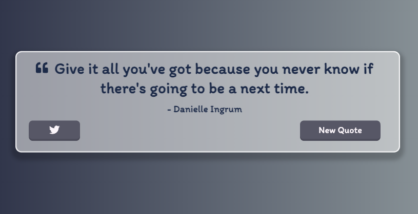

# Quote Generator App

This repository contains the code for a quote generator app that fetches quotes from the [type.fit](https://type.fit/api/quotes) API. The app displays random quotes to inspire and motivate users.

## Live Demo

You can access the live demo of the app [here](https://quote-generator-pradeep.netlify.app/).

## Features

- Fetches random quotes from the [type.fit]https://type.fit/api/quotes) API.
- Displays a new quote each time the button is clicked.
- Provides an option to share the quote on twitter.
- Responsive design for optimal viewing experience across devices.

## Technologies Used

- HTML
- CSS
- React
- CRA(Create React App)

## Getting Started

To run the quote generator app locally, follow these steps:

1. Clone the repository: `git clone https://github.com/pradeepkhanal23/Quote-generator.git`
2. Navigate to the project directory: `cd Quote-generator`
3. Open the `index.html` file in your web browser.

## Usage

1. Open the app in your browser.
2. A random quote will be displayed automatically.
3. Click the "New Quote" button to fetch and display a new random quote.
4. Click the "Twitter " icon to share the quote in twitter platform.

## API

This app fetches quotes from the [type.fit](https://type.fit) API. The API provides a collection of free, open-source quotes that can be used in various applications.

## License

This project is licensed under the [MIT License](LICENSE).

## Contact

If you have any questions or suggestions, feel free to reach out.

My info:

- Email: pradeepkhanal642@gmail.com
